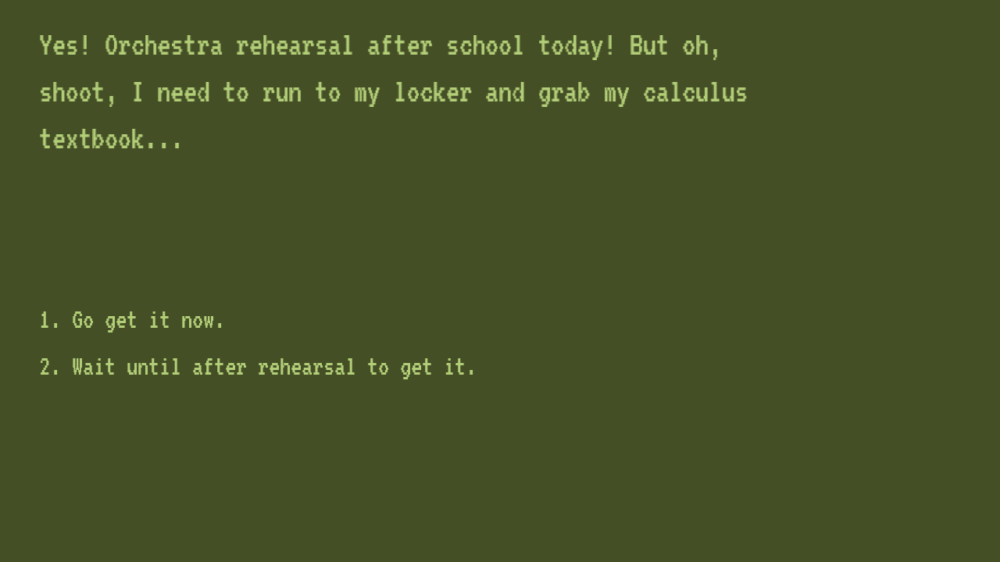

# Tugging at My (Heart) Strings

Author: Anna Li

Design: You're a young, naive high school girl getting through your weekly orchestra rehearsal. All of your thoughts seem to revolve around your one friend, Christina, and because you're young and naive, you think that these thoughts are completely normal, platonic thoughts to have.

Text Drawing: Story is written in a JSON file that is parsed at runtime using the nholmann JSON library. Used Harfbuzz to shape the text and FreeType to render, which is done at runtime. As we read from the buffer, glyphs are loaded, and textures are generated and stored for each glyph.

Screen Shot:

How To Play:

Press '1' or '2' to make your decision on how to act given the inner thoughts presented to you. The outcomes will vary based on how persistent you are and how few farts you give about Mrs. Carter and duet practice.

Sources:

VT323 Regular font from https://www.fontsquirrel.com/ under the SIL Open Font License.

nholmann JSON library from https://github.com/nlohmann/json.

This game was built with [NEST](NEST.md).

